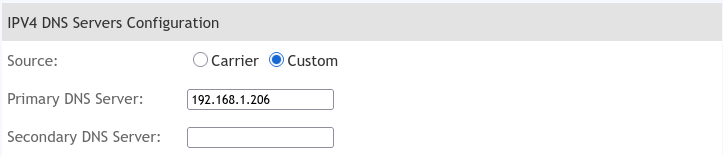

# AdGuard Home

AdGuard Home is a self-hosted DNS server + AdBlocker with a friendly UI.

### Repo

[https://github.com/AdguardTeam/AdGuardHome](https://github.com/AdguardTeam/AdGuardHome)

### Website

[https://adguard.com/en/adguard-home/overview.html](https://adguard.com/en/adguard-home/overview.html)

## Guide

### Setting up the DNS

Adguard Home works as a DNS server and AdBlocker, but for it to work, it needs to be setup to BE your DNS server.

This changes from ISP to ISP, but you need to log in to your router's admin dashboard, find the setting that pertains to the DNS server, and add your AdGuard's IP address.

For example, in my router:

### AdBlocking

By default Adguard already comes with some preconfigured repositories for [DNS Blocklists](https://cwiki.apache.org/confluence/display/SPAMASSASSIN/DnsBlocklists/), which is what allows it to block the known ad services IPs.

You can add more repositories by going to `Filters` > `DNS Blocklists`. They auto-update so you don't have to worry about that.

The additional sources I added were:

[hagezi blocklists](https://github.com/hagezi/dns-blocklists)

[EasyList](https://easylist.to/easylist/easylist.txt)

### VPN Setup

If you're using a VPN and want to access your internal services using their domain names, some small gymnastics is needed.

#### 1. Subnet Router

The first thing you need is a subnet router to your LAN.

If you're using Tailscale, see theie guide on [Subnet Routers](https://tailscale.com/kb/1019/subnets).

If you're using Wireguard, it's harder, but more fun. You can read some [Reddit threads](https://www.reddit.com/r/WireGuard/comments/1c4bdus/how_can_i_configure_wireguard_to_only_access/) or use some utility like [wg-easy](https://github.com/wg-easy/wg-easy/discussions/1401).

#### 2. VPN DNS

In Wireguard, you only need to set the `DNS` attribute to your AdGuard's IP, after you've set up the subnet router. If that doesn't work, look into using [PostUp](https://serverfault.com/questions/1058255/configure-dns-routing-in-wireguard).

In Tailscale, you need to access the admin dashboard and set the DNS to `Partial DNS`, and put your Adguard's IP there. Then you can put your domains' wildcard as the restricted domain, and it should work!

### Other useful features

Adult Content Blocking: You can block access to websites containing adult material.

Forced Safe Search: It can enforce Safe Search on popular search engines (Google, Bing, DuckDuckGo, etc.) and also enable YouTube Restricted Mode to filter out inappropriate content from search results and YouTube.

Blocked Services: Easily block access to entire popular services (like social media platforms or specific streaming services) for selected devices or clients with a single click.

Scheduling: Some versions or integrations allow you to schedule when parental controls are active (e.g., blocking services during certain hours).

Per-Client Configuration: You can apply different blocking rules and parental control settings to individual devices or clients on your network (e.g., stricter rules for a child's tablet vs. an adult's laptop).

Blocking Malware and Phishing: Beyond ads, you can enable filters (like the built-in Browsing security feature) that block domains known to host malware or phishing content, enhancing your network's overall security.

Privacy Protection: AdGuard Home can block known trackers and analytics requests across all devices, including those on smart TVs and IoT devices where traditional browser extensions don't work.

Encrypted DNS Upstreams: You can configure AdGuard Home to use encrypted protocols like DNS-over-HTTPS (DoH), DNS-over-TLS (DoT), or DNSCrypt for its communication with upstream DNS servers. This prevents your Internet Service Provider (ISP) or others from seeing your DNS queries.

DNSSEC Support: AdGuard Home supports DNS Security Extensions (DNSSEC), which provides an additional layer of security by verifying that DNS responses have not been tampered with.
